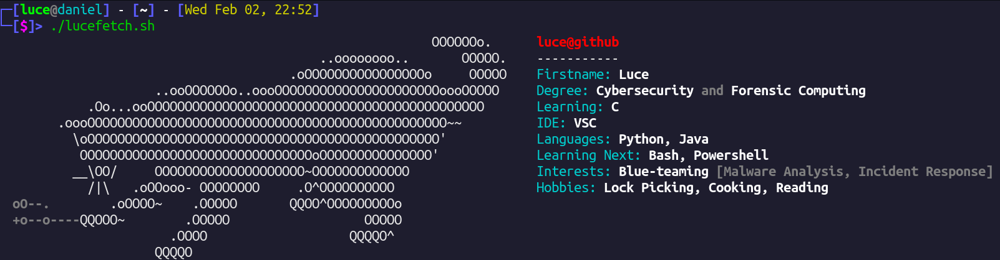

<h1 align="center">Welcome to my Github page!</h1>
<b align="center">I'm Luce, and you should change your password</b>
## Quick Summary

  
  
  
 <i>More stats for the nosey ones ;) </i>

## ToDo
- Match the colour scheme of the stats and lucefetch output
- Build something using C!
